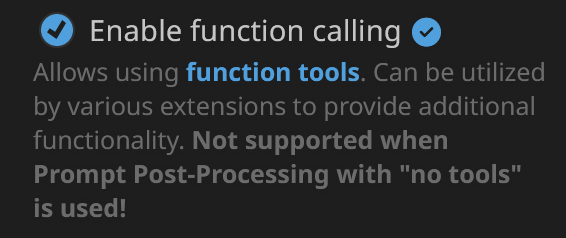
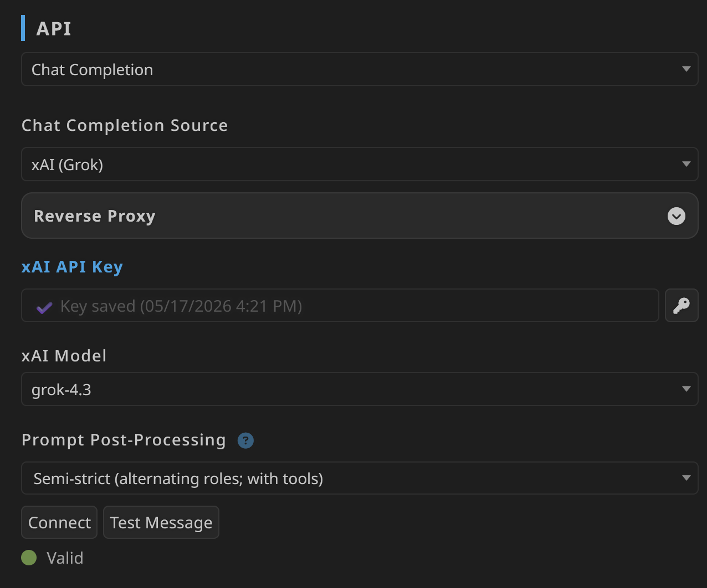
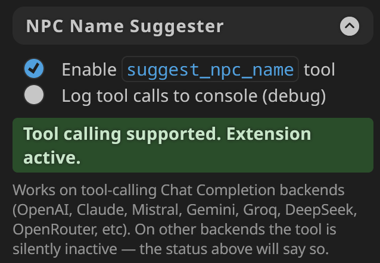

# SillyTavern NPC Name Suggester

A SillyTavern extension that picks NPC names from a curated database, so the AI stops inventing yet another Elara or Marcus.

The AI calls the tool whenever it introduces a new character. It can pass filters like gender, culture, era, vibe. It gets back a first and last name plus a few tags to colour the narration. Names already used in the chat will not show up again.

The AI is supposed to call the tool on its own whenever it introduces a new NPC. 

Pseudo-signature of `suggest_npc_name`:
```
suggest_npc_name(
  gender, language_ethnicity, mythology, race,
  age, era, role, intelligence, allure,
  commonness, genre, themes
)
```

## Install

In SillyTavern, open Extensions, click Install Extension, paste this URL, and confirm:

```
https://github.com/elana-voss/SillyTavern-Extension-NPCNames
```

## Setup

Three settings need flipping on after install.

### Step 1: Enable function calling



In the Chat Completion Presets panel, tick **Enable function calling**.

### Step 2: Pick a Prompt Post-Processing preset that includes tools



In the API panel, set Prompt Post-Processing to one of the "with tools" options. The ones without `with tools` in the name will not let the AI call any tools.

### Step 3: Turn on the extension



In Extensions, find NPC Name Suggester and tick **Enable suggest_npc_name tool**. The status badge turns green.

## Verify it works

These prompts are just to confirm the tool fires. In normal roleplay you do not type anything special; the AI calls the tool on its own whenever a new NPC enters the scene.

Drop one of these into a chat:

> Introduce a new NPC walking into the scene right now.

> A grizzled noir-coded private investigator from the 1920s walks into the bar. Introduce him.

> Three peasant farmhands stop the party at the gate. Name them.

If the debug-log checkbox is on, every call shows up in the browser devtools console. See [docs/4_sillytavern_console_example.txt](docs/4_sillytavern_console_example.txt) for an example trace.

## Backend requirement

Only works with AI backends that support tool calling. Most modern Chat Completion APIs do. If yours does not, the status badge says so and the extension does nothing.

## Settings

Two checkboxes:

- **Enable suggest_npc_name tool**: on by default.
- **Log tool calls to console (debug)**: off by default.

The extension also adds a chunk of text to the system prompt explaining the tool to the AI. See [assets/advertisement.txt](assets/advertisement.txt) for the wording.

## Where the data comes from

The name database was built by the cardwave project: https://github.com/elana-voss/cardwave. This extension ships a copy of the data and a small JavaScript port of the name picker.

## License

LGPL-2.1-or-later. The database includes content from hackerb9/ssa-baby-names which is LGPL-2.1, so the whole extension follows the same license. Full per-corpus attribution in [THIRD_PARTY_LICENSES.md](THIRD_PARTY_LICENSES.md).
